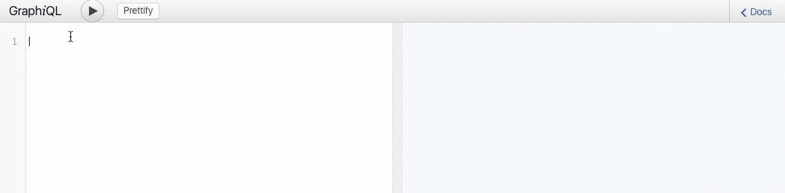

# Graphcool API

## TL; DR

Use Graphcool to build a GraphQL backend in minutes which works with any framework. Save valuable time so you can focus on your product and presentation.

## What Graphcool provides

You and your team want to hack away on ideas disrupting the mobility sector. At a hackathon you win by having a cool idea and an awesome presentation. However sometimes you need a backend to be able to fully present your idea.

Using a backend as a service you can save a lot of time that you can use on more important things such as preparing your killer demo or adding another feature.

If you have used a backend as a service before you know they can be a pain to work with. Firebase has a limited data model and Parse does not allow realtime subscriptions. Graphcool solves these problems by using new a technology developed by Facebook. Using Graphcool, you can leverage all the benefits of [GraphQL](http://graphql.org), for example the interactive experience of exploring the API:

The playground features auto-completion and a full documentation of your API enabling quick prototyping of your application.

## Hackathon Heroes

Look out for two friendly developers in green t-shirts at the hackathon ready to help you.

You can also [chat to our CTO](http://slack.graph.cool) who is sitting at his desk waiting to answer your questions.

## Get Started

To get started with your backend, sign in [at Graphcool](http://graph.cool) and follow the getting started tour.
We have a few examples to kickstart your application:

* **React**
  * [Todo List](https://github.com/graphcool-examples/react-lokka-todo-example)
  * [Instagram](https://github.com/graphcool-examples/react-relay-instagram-example)
  * [Pokedex](https://github.com/learnapollo/pokedex-react/tree/master/exercise-06-solution)

* **React Native**
  * [Instagram](https://github.com/graphcool-examples/react-native-apollo-instagram-example)

* **Angular 2**
  * [Todo List](https://github.com/graphcool-examples/angular-apollo-todo-example)
  * [Instagram](https://github.com/graphcool-examples/angular-apollo-instagram-example)
